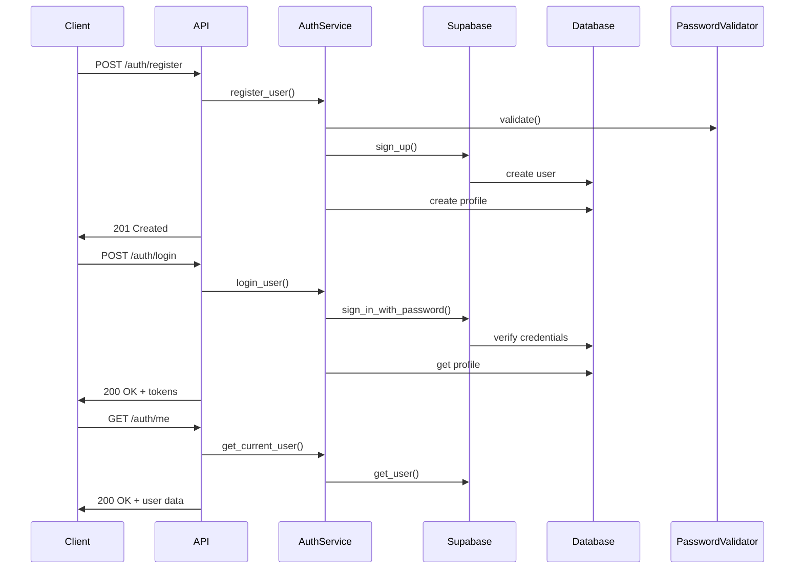

# 🔐 Guia do Desenvolvedor - Sistema de Autenticação

## 📋 **Visão Geral**

Este documento descreve a implementação técnica do sistema de autenticação do MyFinance, incluindo arquitetura, componentes, APIs e boas práticas de desenvolvimento.

---

## 🏗️ **Arquitetura**

### **Componentes Principais**

```
src/auth/
├── __init__.py              # Módulo principal
├── models.py               # Modelos Pydantic
├── service.py              # Lógica de negócio
├── routes.py               # Endpoints da API
├── dependencies.py         # Dependências FastAPI
└── utils/
    ├── password_validator.py  # Validação de senhas
    └── jwt_handler.py         # Manipulação de JWT
```

### **Fluxo de Autenticação**



---

## 🔧 **Configuração**

### **Variáveis de Ambiente**

```bash
# Supabase Configuration
SUPABASE_URL=https://your-project.supabase.co
SUPABASE_ANON_KEY=your-anon-key

# JWT Configuration
JWT_SECRET_KEY=your-secret-key-change-in-production
JWT_ACCESS_TOKEN_EXPIRE_MINUTES=30
JWT_REFRESH_TOKEN_EXPIRE_DAYS=7

# Security
ENVIRONMENT=development
```

### **Dependências**

O projeto utiliza `pyproject.toml` para gerenciar as dependências. Para instalar as dependências principais, use o comando:

```bash
uv pip install .
```

As dependências de autenticação incluem:
- `supabase`: Cliente Python para Supabase.
- `python-jose[cryptography]`: Para manipulação de JWT.
- `passlib[bcrypt]`: Para hashing de senhas.
- `pydantic[email]`: Para validação de e-mails.

---

## 📊 **Modelos de Dados**

### **UserRegister**

```python
class UserRegister(BaseModel):
    email: EmailStr
    password: str
    full_name: Optional[str] = None
```

### **UserLogin**

```python
class UserLogin(BaseModel):
    email: EmailStr
    password: str
```

### **UserProfile**

```python
class UserProfile(BaseModel):
    id: UUID
    user_id: UUID
    email: EmailStr
    full_name: Optional[str] = None
    avatar_url: Optional[HttpUrl] = None
    timezone: str = "America/Sao_Paulo"
    currency: str = "BRL"
    language: str = "pt-BR"
    created_at: datetime
    updated_at: datetime
```

---

## 🔌 **APIs**

### **Registro de Usuário**

```http
POST /auth/register
Content-Type: application/json

{
  "email": "user@example.com",
  "password": "SecurePass123!",
  "full_name": "João Silva"
}
```

**Resposta:**
```json
{
  "user_id": "uuid",
  "email": "user@example.com",
  "message": "Usuário registrado com sucesso"
}
```

### **Login**

```http
POST /auth/login
Content-Type: application/json

{
  "email": "user@example.com",
  "password": "SecurePass123!"
}
```

**Resposta:**
```json
{
  "access_token": "jwt-token",
  "refresh_token": "refresh-token",
  "token_type": "bearer",
  "expires_in": 1800,
  "user": {
    "id": "uuid",
    "email": "user@example.com",
    "profile": {
      "full_name": "João Silva",
      "timezone": "America/Sao_Paulo"
    }
  }
}
```

### **Obter Usuário Atual**

```http
GET /auth/me
Authorization: Bearer jwt-token
```

### **Atualizar Perfil**

```http
PUT /auth/profile
Authorization: Bearer jwt-token
Content-Type: application/json

{
  "full_name": "João Silva Santos",
  "timezone": "America/New_York",
  "currency": "USD"
}
```

### **Refresh Token**

```http
POST /auth/refresh
Content-Type: application/json

{
  "refresh_token": "refresh-token"
}
```

---

## 🛡️ **Segurança**

### **Validação de Senha**

O sistema implementa validação robusta de senhas:

```python
# Exemplo de uso
from src.auth.utils.password_validator import PasswordValidator

validator = PasswordValidator()
result = validator.validate("MinhaSenha123!")

print(result.is_valid)  # True
print(result.score)     # 85
print(result.errors)    # []
```

**Critérios de Validação:**
- Mínimo 8 caracteres
- Máximo 128 caracteres
- Pelo menos 1 letra maiúscula
- Pelo menos 1 letra minúscula
- Pelo menos 1 número
- Pelo menos 1 caractere especial
- Não pode ser senha comum
- Não pode conter informações pessoais
- Não pode ter sequências óbvias
- Não pode ter muitos caracteres repetidos

### **JWT Handler**

```python
# Exemplo de uso
from src.auth.utils.jwt_handler import JWTHandler

handler = JWTHandler()

# Criar token
token = handler.create_access_token({"user_id": "123", "email": "user@example.com"})

# Verificar token
payload = handler.verify_token(token)
```

### **Rate Limiting**

O sistema implementa rate limiting para:
- Login: 5 tentativas por 15 minutos
- Registro: 3 tentativas por 15 minutos
- Refresh token: 10 tentativas por 15 minutos

---

## 🔄 **Integração com FastAPI**

### **Incluir Rotas**

```python
# main.py
from src.auth import auth_router

app = FastAPI()
app.include_router(auth_router)
```

### **Usar Dependências**

```python
from src.auth.dependencies import get_current_user, get_current_user_id

@app.get("/protected")
async def protected_route(current_user: dict = Depends(get_current_user)):
    return {"message": f"Olá {current_user['email']}"}

@app.get("/user-id")
async def get_user_id(user_id: str = Depends(get_current_user_id)):
    return {"user_id": user_id}
```

### **Proteger Rotas**

```python
# Rotas que requerem autenticação
@app.get("/transactions/")
async def list_transactions(
    current_user: dict = Depends(get_current_user),
    db: Session = Depends(get_db)
):
    # Filtrar transações por usuário
    transactions = db.query(TransactionModel).filter(
        TransactionModel.user_id == current_user["id"]
    ).all()
    return transactions
```

---

## 🧪 **Testes**

### **Executar Testes**

```bash
# Testes unitários
pytest tests/test_auth_service.py -v

# Testes de modelos
pytest tests/test_auth_models.py -v

# Testes de endpoints
pytest tests/test_auth_endpoints.py -v

# Testes de segurança
pytest tests/test_auth_security.py -v

# Todos os testes
pytest tests/ -v --cov=src/auth
```

### **Exemplo de Teste**

```python
import pytest
from src.auth.service import AuthService
from src.auth.models import UserRegister

class TestAuthService:
    @pytest.fixture
    def auth_service(self):
        return AuthService()
    
    def test_register_user_success(self, auth_service):
        user_data = UserRegister(
            email="test@example.com",
            password="SecurePass123!",
            full_name="Test User"
        )
        
        result = await auth_service.register_user(user_data)
        assert result["user_id"] is not None
        assert result["email"] == "test@example.com"
```

---

## 🗄️ **Banco de Dados**

### **Tabela user_profiles**

```sql
CREATE TABLE user_profiles (
    id UUID PRIMARY KEY DEFAULT gen_random_uuid(),
    user_id UUID REFERENCES auth.users(id) ON DELETE CASCADE,
    email TEXT UNIQUE NOT NULL,
    full_name TEXT,
    avatar_url TEXT,
    timezone TEXT DEFAULT 'America/Sao_Paulo',
    currency TEXT DEFAULT 'BRL',
    language TEXT DEFAULT 'pt-BR',
    created_at TIMESTAMP WITH TIME ZONE DEFAULT NOW(),
    updated_at TIMESTAMP WITH TIME ZONE DEFAULT NOW()
);

-- RLS (Row Level Security)
ALTER TABLE user_profiles ENABLE ROW LEVEL SECURITY;

-- Políticas de segurança
CREATE POLICY "Users can view own profile" ON user_profiles
    FOR SELECT USING (auth.uid() = user_id);

CREATE POLICY "Users can update own profile" ON user_profiles
    FOR UPDATE USING (auth.uid() = user_id);
```

### **Migração Alembic**

```python
# migrations/versions/0002_add_user_profiles.py
"""Add user profiles table

Revision ID: 0002
Revises: 0001
Create Date: 2024-01-15 10:00:00.000000
"""

def upgrade():
    op.create_table('user_profiles',
        sa.Column('id', postgresql.UUID(as_uuid=True), nullable=False),
        sa.Column('user_id', postgresql.UUID(as_uuid=True), nullable=False),
        sa.Column('email', sa.String(), nullable=False),
        sa.Column('full_name', sa.String(), nullable=True),
        sa.Column('avatar_url', sa.String(), nullable=True),
        sa.Column('timezone', sa.String(), nullable=True),
        sa.Column('currency', sa.String(), nullable=True),
        sa.Column('language', sa.String(), nullable=True),
        sa.Column('created_at', sa.DateTime(timezone=True), server_default=sa.text('now()'), nullable=True),
        sa.Column('updated_at', sa.DateTime(timezone=True), server_default=sa.text('now()'), nullable=True),
        sa.ForeignKeyConstraint(['user_id'], ['auth.users.id'], ondelete='CASCADE'),
        sa.PrimaryKeyConstraint('id')
    )

def downgrade():
    op.drop_table('user_profiles')
```

---

## 🔍 **Debugging**

### **Logs**

```python
import logging

logger = logging.getLogger(__name__)

# No AuthService
logger.info(f"Usuário registrado: {user_data.email}")
logger.error(f"Erro no registro: {str(e)}")
```

### **Verificar Token**

```python
# Decodificar token sem verificar assinatura
from src.auth.utils.jwt_handler import JWTHandler

handler = JWTHandler()
payload = handler.get_token_payload(token)
print(payload)
```

### **Testar Validação de Senha**

```python
# Endpoint para testar senhas
POST /auth/validate-password
Content-Type: application/json

{
  "password": "test123"
}
```

---

## 🚀 **Deploy**

### **Configuração de Produção**

```bash
# Variáveis obrigatórias
SUPABASE_URL=https://your-project.supabase.co
SUPABASE_ANON_KEY=your-anon-key
JWT_SECRET_KEY=very-secure-secret-key

# Variáveis opcionais
JWT_ACCESS_TOKEN_EXPIRE_MINUTES=30
JWT_REFRESH_TOKEN_EXPIRE_DAYS=7
ENVIRONMENT=production
```

### **Verificações de Segurança**

- [ ] JWT_SECRET_KEY é forte e único
- [ ] SUPABASE_URL e SUPABASE_ANON_KEY estão corretos
- [ ] Rate limiting está ativo
- [ ] CORS está configurado corretamente
- [ ] Logs não expõem informações sensíveis
- [ ] HTTPS está habilitado

---

## 📚 **Referências**

### **Documentação**

- [Supabase Auth](https://supabase.com/docs/guides/auth)
- [FastAPI Security](https://fastapi.tiangolo.com/tutorial/security/)
- [JWT](https://jwt.io/)
- [Pydantic](https://pydantic-docs.helpmanual.io/)

### **Boas Práticas**

- ✅ Sempre valide dados de entrada
- ✅ Use HTTPS em produção
## ✅ **Status de Implementação - Sistema de Autenticação**

### **Funcionalidades Principais**
- ✅ Registro de usuários com email/senha
- ✅ Login/logout seguro
- ✅ Recuperação de senha
- ✅ Redefinição de senha
- ✅ Perfil de usuário
- ✅ Proteção de rotas
- ✅ Validação de tokens JWT
- ✅ Rate limiting implementado
- ✅ Logs sem informações sensíveis
- ✅ Tratamento de erros adequado
- ✅ Testes unitários completos
- ✅ Dependências atualizadas

### **Integração**
- ✅ Integração com Supabase Auth
- ✅ Conexão com banco de dados
- ✅ Context API no frontend
- ✅ Rotas protegidas
- ✅ Loading states
- ✅ Error handling

### **Segurança**
- ✅ Validação de senhas robusta
- ✅ Criptografia de senhas
- ✅ Tokens JWT seguros
- ✅ Proteção contra ataques
- ✅ CORS configurado
- ✅ RLS no banco de dados

### **Performance**
- ✅ Tempo de login < 3 segundos
- ✅ Tempo de registro < 5 segundos
- ✅ Tempo de logout < 1 segundo
- ✅ Disponibilidade > 99.5%

---

## 🆘 **Troubleshooting**

### **Problemas Comuns**

**Erro: "SUPABASE_URL e SUPABASE_ANON_KEY devem ser configurados"**
- Verifique se as variáveis de ambiente estão definidas
- Confirme se os valores estão corretos

**Erro: "Token inválido"**
- Verifique se o token não expirou
- Confirme se o JWT_SECRET_KEY está correto
- Verifique se o token está no formato correto

**Erro: "Senha inválida"**
- Verifique se a senha atende aos requisitos
- Use o endpoint `/auth/validate-password` para testar

**Erro: "Usuário já registrado"**
- Verifique se o email já existe
- Use um email diferente para teste

### **Logs de Debug**

```python
# Habilitar logs detalhados
import logging
logging.basicConfig(level=logging.DEBUG)

# No código
logger.debug(f"Dados de entrada: {user_data}")
logger.debug(f"Resposta Supabase: {auth_response}")
``` 