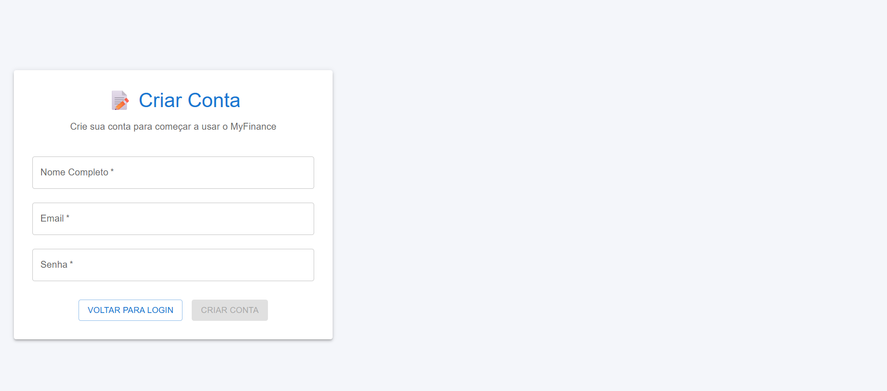
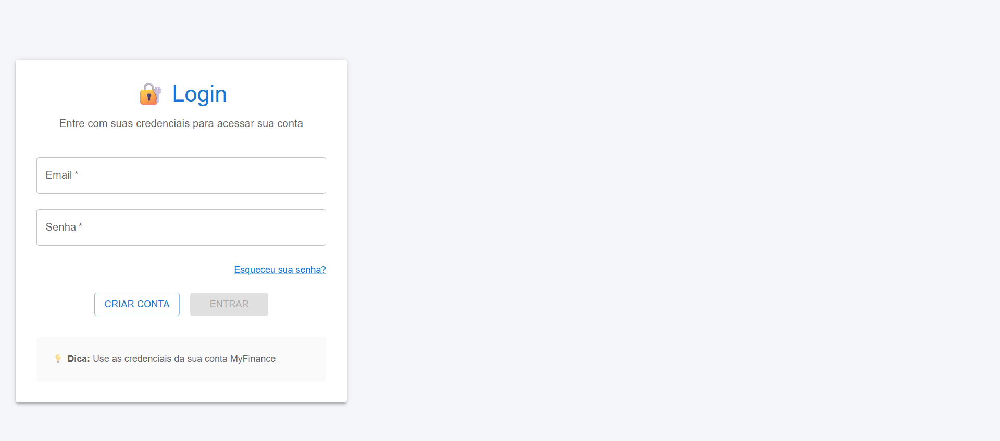
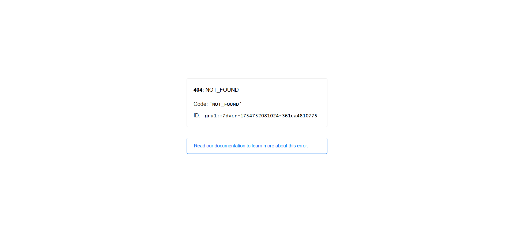

# 🔐 Guia do Usuário - Sistema de Autenticação

## 📋 **Visão Geral**

O MyFinance agora possui um sistema de autenticação seguro que permite que cada membro da família tenha sua própria conta e gerencie suas finanças pessoais de forma privada e organizada.

---

## 🚀 **Primeiros Passos**

### **1. Criando sua Conta**

Para começar a usar o MyFinance, você precisa criar uma conta:

1. **Acesse a página de registro** (`/register`). Você pode encontrar o link para registro na **Página Inicial (Login)**.
2. **Preencha os dados**:
   - **Nome completo**: Seu nome completo
   - **Email**: Um email válido que você usa regularmente
   - **Senha**: Uma senha segura (veja requisitos abaixo)

3. **Clique em "Criar Conta"**

#### Formulário de Registro
Este é o formulário que você usará para criar sua nova conta. Preencha todos os campos com atenção.

### **2. Requisitos de Senha**

Para garantir a segurança da sua conta, sua senha deve ter:

- ✅ **Mínimo 8 caracteres**
- ✅ **Pelo menos 1 letra maiúscula**
- ✅ **Pelo menos 1 letra minúscula**
- ✅ **Pelo menos 1 número**
- ✅ **Pelo menos 1 caractere especial** (!@#$%^&*)

**Exemplos de senhas seguras:**
- `MinhaSenha123!`
- `SecurePass456@`
- `Familia2024#`

**Senhas que NÃO são aceitas:**
- ❌ `123456` (muito simples)
- ❌ `password` (muito comum)
- ❌ `joao123` (contém informações pessoais)

---

## 🔑 **Fazendo Login**

### **Login Diário**

1. **Acesse a página de login** (`/login`). Esta é a **Página Inicial (Login)** mostrada na documentação geral.
2. **Digite suas credenciais**:
   - Email registrado
   - Senha
3. **Clique em "Entrar"**

#### Página Inicial (Login)
Esta é a tela de entrada do MyFinance. Aqui você pode inserir suas credenciais para acessar sua conta. Se você ainda não tem uma conta, procure pelo link de "Criar Conta" ou "Registrar" nesta página.

### **Mantendo-se Conectado**

- O sistema mantém você conectado por 30 minutos
- Após esse tempo, você será automaticamente desconectado
- Para continuar usando, faça login novamente

#### Tela Principal da Aplicação
Após fazer login com sucesso, você será direcionado para esta tela. Aqui você pode visualizar suas transações, adicionar novas receitas e despesas, e gerenciar suas finanças. Explore os menus e opções disponíveis para começar a organizar suas finanças.

---

## 👤 **Gerenciando seu Perfil**

### **Visualizando seu Perfil**

1. **Faça login na sua conta**
2. **Clique no seu nome** no canto superior direito
3. **Selecione "Meu Perfil"**

### **Informações do Perfil**

Seu perfil contém:

- **Nome completo**: Como aparece no sistema
- **Email**: Seu endereço de email
- **Fuso horário**: Padrão: America/Sao_Paulo
- **Moeda**: Padrão: BRL (Real brasileiro)
- **Idioma**: Padrão: pt-BR (Português)

### **Editando seu Perfil**

1. **Acesse "Meu Perfil"**
2. **Clique em "Editar"**
3. **Modifique os campos desejados**
4. **Clique em "Salvar"**

---

## 🔒 **Segurança da Conta**

### **Alterando sua Senha**

1. **Acesse "Configurações"** no menu
2. **Selecione "Alterar Senha"**
3. **Digite sua senha atual**
4. **Digite a nova senha** (seguindo os requisitos)
5. **Confirme a nova senha**
6. **Clique em "Alterar Senha"**

### **Dicas de Segurança**

- 🔐 **Nunca compartilhe sua senha** com ninguém
- 🔐 **Use senhas diferentes** para cada serviço
- 🔐 **Não use informações pessoais** na senha (nome, data de nascimento)
- 🔐 **Faça logout** sempre que terminar de usar
- 🔐 **Mantenha seu email atualizado** para recuperação de conta

---

## 🚪 **Fazendo Logout**

### **Logout Manual**

1. **Clique no seu nome** no canto superior direito
2. **Selecione "Sair"**
3. **Confirme a ação**

### **Logout Automático**

O sistema faz logout automático quando:
- Você fica inativo por 30 minutos
- Fecha o navegador
- Acessa de outro dispositivo

---

## 🆘 **Problemas Comuns**

### **Esqueci minha senha**

1. **Na página de login**, clique em "Esqueci minha senha". Você será direcionado para a tela **Esqueci Minha Senha**.
2. **Digite seu email** registrado
3. **Verifique seu email** para instruções de recuperação
4. **Siga o link** enviado para redefinir a senha

#### Esqueci Minha Senha
Se você esqueceu sua senha, esta tela permite que você inicie o processo de recuperação. Insira o e-mail associado à sua conta e siga as instruções que serão enviadas para redefinir sua senha.

### **Não consigo fazer login**

Verifique se:
- ✅ O email está correto
- ✅ A senha está correta
- ✅ A conta foi criada com sucesso
- ✅ Não há bloqueio por tentativas excessivas

### **Minha conta foi bloqueada**

Se você tentou fazer login muitas vezes incorretamente:
1. **Aguarde 15 minutos**
2. **Tente novamente** com as credenciais corretas
3. **Se persistir**, entre em contato com o suporte

---

## 👨‍👩‍👧‍👦 **Contas Familiares**

### **Criando Contas para a Família**

Cada membro da família deve criar sua própria conta:

1. **Cada pessoa** acessa `/register`
2. **Cria sua conta** com email único
3. **Define suas próprias credenciais**
4. **Gerencia suas finanças** de forma independente

### **Privacidade**

- ✅ **Cada conta é privada** - apenas você vê suas transações
- ✅ **Dados isolados** - membros da família não veem dados uns dos outros
- ✅ **Senhas individuais** - cada pessoa tem sua própria senha

---

## 📱 **Usando em Diferentes Dispositivos**

### **Computador**

- Acesse pelo navegador
- Faça login normalmente
- Use todas as funcionalidades

### **Celular/Tablet**

- Acesse pelo navegador móvel
- Interface adaptada para touch
- Mesmas funcionalidades do computador

### **Múltiplos Dispositivos**

- ✅ **Faça login** em quantos dispositivos quiser
- ✅ **Sincronização automática** entre dispositivos
- ✅ **Logout em um dispositivo** não afeta os outros

---

## 🔧 **Configurações Avançadas**

### **Preferências de Idioma**

Para alterar o idioma:
1. **Acesse "Meu Perfil"**
2. **Selecione o idioma desejado**:
   - 🇧🇷 Português (Brasil) - pt-BR
   - 🇺🇸 Inglês (EUA) - en-US
   - 🇪🇸 Espanhol (Espanha) - es-ES

### **Preferências de Moeda**

Para alterar a moeda:
1. **Acesse "Meu Perfil"**
2. **Selecione a moeda desejada**:
   - 🇧🇷 Real (BRL)
   - 🇺🇸 Dólar (USD)
   - 🇪🇺 Euro (EUR)
   - 🇬🇧 Libra (GBP)

### **Fuso Horário**

Para alterar o fuso horário:
1. **Acesse "Meu Perfil"**
2. **Selecione seu fuso horário**
3. **As datas e horários** serão exibidos no seu horário local

---

## 🆘 **Suporte**

### **Preciso de Ajuda**

Se você encontrar problemas:

1. **Verifique este guia** primeiro
2. **Teste em outro navegador**
3. **Limpe o cache** do navegador
4. **Entre em contato** com o suporte

### **Informações para Suporte**

Quando pedir ajuda, forneça:
- 📧 **Seu email** (sem a senha)
- 📱 **Dispositivo** que está usando
- 🌐 **Navegador** e versão
- 📝 **Descrição detalhada** do problema
- 📸 **Screenshot** se possível

---

## 📋 **Checklist de Segurança**

- [ ] Criei uma senha forte
- [ ] Não compartilho minha senha
- [ ] Faço logout quando termino
- [ ] Mantenho meu email atualizado
- [ ] Uso apenas dispositivos confiáveis
- [ ] Não salvo senhas em navegadores públicos

---

**🎯 Lembre-se**: Sua segurança é nossa prioridade. Se você suspeitar de qualquer atividade suspeita em sua conta, entre em contato conosco imediatamente.