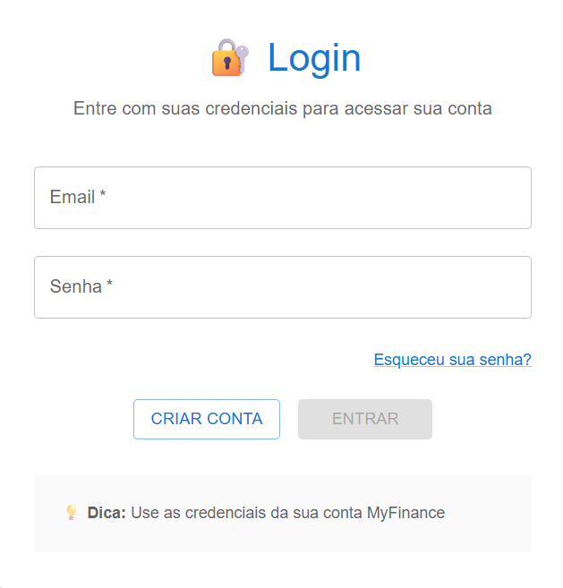

# Manual do Usuário

Bem-vindo ao MyFinance!

Este sistema permite o cadastro e visualização de receitas e despesas de forma simples e eficiente.

## Como Usar

### Acessando o MyFinance

Para começar a usar o MyFinance, abra seu navegador e acesse: [https://myfinance-three.vercel.app/](https://myfinance-three.vercel.app/).

Você será recebido pela tela de Login, que oferece as seguintes opções:

*   **Entrar**: Se você já possui uma conta, insira seu **Email** e **Senha** nos campos correspondentes e clique no botão **"ENTRAR"**. Isso o levará diretamente para a área principal do MyFinance.
*   **Criar Conta**: Se você é um novo usuário, clique no botão **"CRIAR CONTA"**. Você será guiado por um processo simples para registrar-se e começar a organizar suas finanças.
*   **Esqueceu sua senha?**: Caso não se lembre da sua senha, clique neste link. Siga as instruções para redefini-la e recuperar o acesso à sua conta.

### Registrando suas Transações

Após fazer login (ou criar sua conta), você estará pronto para registrar suas receitas e despesas:

*   **Tipo**: Selecione se a transação é uma **Receita** (dinheiro que entra) ou uma **Despesa** (dinheiro que sai).
*   **Valor**: Informe o valor numérico da transação.
*   **Descrição**: Descreva brevemente do que se trata a transação (ex: "Salário", "Conta de Luz", "Compras no Supermercado").
*   **Adicionar**: Clique no botão **"Adicionar"** para salvar a transação.

### Visualizando suas Finanças

Todas as transações que você adicionar aparecerão em uma lista logo abaixo do formulário, permitindo que você acompanhe seu fluxo financeiro de forma clara.

A documentação será atualizada conforme novas funcionalidades forem implementadas. 