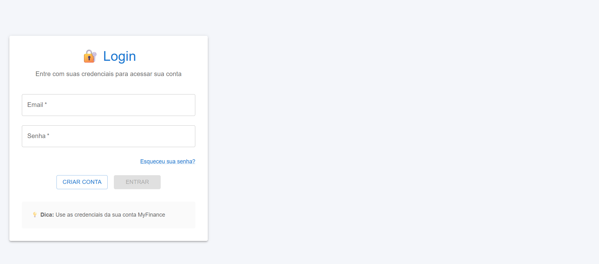
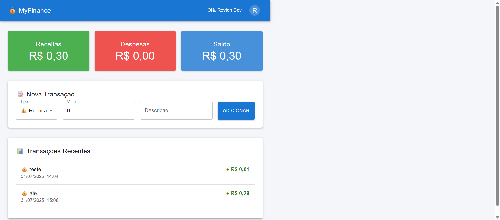

# Manual do Usuário MyFinance

Bem-vindo ao MyFinance! Este guia irá ajudá-lo a usar o sistema de forma eficiente para gerenciar suas finanças.

## Acessando o Sistema

Para começar, acesse a aplicação através do seguinte link:
[https://myfinance-three.vercel.app/](https://myfinance-three.vercel.app/)

Você será apresentado à tela de login inicial.

### Tela Inicial (Login)
Esta é a primeira tela que você verá. Se você já possui uma conta, pode fazer o login aqui. Caso contrário, você pode se registrar para criar uma nova conta.

Para mais detalhes sobre como criar uma conta, fazer login ou recuperar sua senha, consulte o [Guia de Autenticação do Usuário](autenticacao-guia-usuario.md).

## Tela Principal da Aplicação

Após o login, você será direcionado para a tela principal, onde poderá gerenciar suas transações financeiras.

### Visão Geral da Tela Principal
A tela principal permite que você adicione novas receitas e despesas, visualize seu histórico de transações e acompanhe seu saldo.

### Funcionalidades Principais

- **Adicionar Transação**: Use o formulário para adicionar novas receitas ou despesas.
  - **Tipo**: Selecione "Receita" ou "Despesa".
  - **Valor**: Insira o valor da transação.
  - **Descrição**: Forneça uma breve descrição.
- **Visualizar Histórico**: A lista de transações mostra todas as suas receitas e despesas registradas.
- **Saldo**: O sistema exibe o saldo atual com base em suas transações.

> **Observação:** Atualmente, os dados são armazenados de forma temporária. Se o sistema for reiniciado, os dados serão perdidos. Estamos trabalhando para implementar a persistência de dados em breve.

## Guia Detalhado de Autenticação

Para informações detalhadas sobre o processo de criação de conta, login, recuperação de senha e gerenciamento de perfil, consulte nosso guia completo:

- **[Guia de Autenticação do Usuário](autenticacao-guia-usuario.md)**

Este guia contém tudo o que você precisa saber para gerenciar sua conta com segurança.